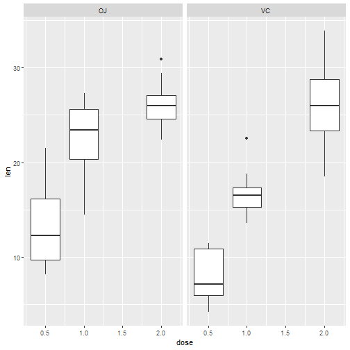

Predicting the Rate of Tooth Growth in Guinea Pigs
========================================================
author: G.Hirang
date: 28 Feb. 2020
autosize: true

INTRODUCTION
========================================================

Using the ToothGrowth dataset and a linear regression model, this App aims to predict the growth of odontoblasts in Guinea Pigs as a response to different dosage levels of Vitamin C in the form of either Orange Juice (OJ) or Ascorbic Acid (VC).

- Each guinea pig received one of 3 doses of vitamin C. 
- Dosage levels at 0.5, 1.0, or 2.0 milligrams per day. 
- Either of 2 delivery methods, Orange Juice (OJ) or Ascorbic Acid (VC). 

EXPLORATORY ANALYSIS
========================================================

- OJ with higher growth at dosage levels of 0.5 and 1.0 mg. 
- VC with more variation at 2.0 mg dosage level. 

TOOTH GROWTH PREDICTION APP
========================================================

Goal of the App: 

- Predict the effect on tooth growth based on a range of dosage levels from 0.4 to 2.1 mg/day. 
- Show estimated growth for both VC and OJ. 

TOOTH GROWTH PREDICTION APP
========================================================

